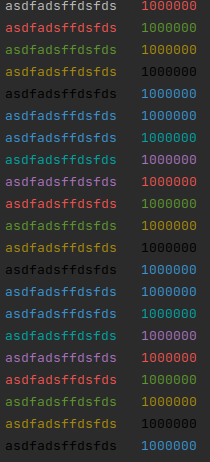

# ft_printf


Project contain ft_printf function which is a realization of stdio.h function printf. 

#### Usage:
```C
#include "includes/ft_printf.h"

int ft_printf(const char *format, ...);
```

### Build:
```shell
mkdir build;
cd build;
cmake ..;
make;
./printf_new
```

### Output example:



The `format` argument will tell the function how and what to print. There are the literal characters and the modulus character. A literal character is everything that is not a modulus character, as it is literal, once the function meets it, it will print it as it is, if it sees an *a* it will print an *a* etc.

But the modulus character works differently and has more control on what should be printed, it will make use of the `...` argument, which is a variadic argument meaning that there can be an undefined number of arguments.

What follows the modulus character ('*%*') is called a format, it will simply format the collected argument(s).
For example the *%s* format will print the argument as a string, so the argument should be a string, if it not, the result is undefined.

As you expect there is not just the *%s* format, so here is a table of all the important formats

| Format | Description | Prototype |
| --- | --- | --- |
| `s` | Prints the string | `const char *` |
| `d`, `i` | Prints the integer | `int` |
| `u` | Print the unsigned integer | `unsigned int` |
| `x` | Prints the integer in hexadecimal | `int` |
| `o` | Prints the integer in octal | `int` |
| `p` | Prints the address of the pointer in hexadecimal | `int` |
| `f` | Print the floating point number | `double` |

There are way more formats, but i am not listing them all as this wiki is just about introducing the function with a minimum of explanation. But keep in mind that this function also implements identifiers, precision, length modifier etc. So here is a link to understand the various combination and possibilities of this function: [printf format identifiers](https://www.lix.polytechnique.fr/~liberti/public/computing/prog/c/C/FUNCTIONS/format.html)

The `ft_printf` function also implements a color format that is not a part of the standards. It allows you to enable colors (you know what is a color, right ?) with this syntax `%{RED}`
